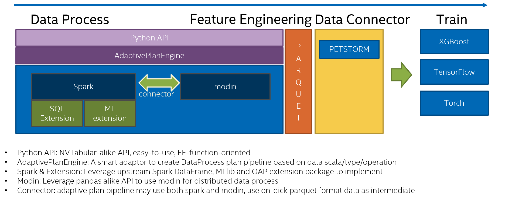

## What is RecDP 
* RecDP is a Data Process python module, specifically designed for Recommender System. 

## Objective
* Easy-to-use – simple APIs for data scientists, easy to migrate from NVTabular
* Collaborative pipeline with spark and modin - provide stableness and scalability of handling huge dataset with spark and modin as underlying distributed data process engine.
* Optimized Performance - 1) Adaptive dataframe plan decision making; 2) Intel-OAP accelerator extensions (SIMD, Cache, Native). 
* Extensible – provides plugin interface to extend intel RECO & Friesian with optimized adaptive DataProcess pipeline plan with spark and modin.
* Feature Engineer oriented – advanced feature engineering functions (target encoding) 

## Currently RecDP is proven by four use case:
* Recsys2021: successfully support intel Recsys2021 challenge feature engineering work
* Recsys2020: successfully processing over 600 millions dataset and aligned with Recsys2021 winner feature engineering work.
* DRLM: successfully processing Criteo dataset of 24 days w/wo frequence limit, previously wo/ frequence limit went failed using NVIDIA provided spark script.
* DIEN: w/ RecDP, process time is 6x speeding up comparing with original Ali-Matrix python script. 

## Design Overview


## How to start
#### install with pip (require preinstall spark)
```
pip install pyrecdp

# noticed that if pyspark version is not detected, we will install pyrecdp for Spark 3.1 or later
# And if you are using pyspark 3.0 or before, you may find scala extension here
${Your_system_python_path}/python3.x/lib/python3.x/site-packages/pyrecdp/ScalaProcessUtils/built/

# example
/opt/intel/oneapi/intelpython/python3.7/lib/python3.7/site-packages/pyrecdp/ScalaProcessUtils/built/
|-- 30
|   `-- recdp-scala-extensions-0.1.0-jar-with-dependencies.jar
`-- 31
    `-- recdp-scala-extensions-0.1.0-jar-with-dependencies.jar

2 directories, 2 files
```

#### install with spark preinstalled docker img
```
docker run --network host -w /home/vmagent/app/ -it xuechendi/recdp_spark3.1 /bin/bash
pip install pyrecdp
```

#### run test
* run below script to perform a test
[test_categorify](tests/test_categorify.py)
* make sure you download the whole [tests](tests) folder, test data is inside
```
# download tests folder
# if you are running with spark 3.0 or before, you may need to specify scala_udf_jars to
# ${Your_system_python_path}/python3.x/lib/python3.x/site-packages/pyrecdp/ScalaProcessUtils/built/30/recdp-scala-extensions-0.1.0-jar-with-dependencies.jar
# or
# ${RecDP_Cloned_Folder}/ScalaProcessUtils/built/30/recdp-scala-extensions-0.1.0-jar-with-dependencies.jar
cd tests
python test_categorify.py
```

#### test with provided jupyter notebook example
* Recsys2021 example [url](https://github.com/oap-project/recdp/blob/master/examples/notebooks/recsys2021/final_submission_feature_engineering.ipynb)
* Recsys2020 example [url](https://github.com/oap-project/recdp/blob/master/examples/notebooks/recsys2020/recsys2020_feature_engineering.ipynb)
* Recsys2020 multiitem-categorify example(support for Analytics Zoo Friesian) [url](https://github.com/oap-project/recdp/blob/master/examples/notebooks/recsys2020/recsys_for_friesian_integration.ipynb)
* DLRM example [url](https://github.com/oap-project/recdp/blob/master/examples/notebooks/dlrm/DLRM_Performance.ipynb)
* DIEN example [url](https://github.com/oap-project/recdp/blob/master/examples/notebooks/dien/dien_data_process.ipynb)

## Advanced
#### compile scala extension
* noted: support spark 3.1 by default, using -pspark3.0 for running with Spark3.0
```
cd ScalaProcessUtils/
mvn package -Pspark-3.1
or
mvn package -Pspark-3.0
```

#### test with provided spark docker img

#### write your own
* some spark configuration is required
```
import init

import findspark
findspark.init()

import os
from pyspark.sql import *
from pyspark import *
import pyspark.sql.functions as f
import pyspark.sql.types as t
from pyrecdp.data_processor import *
from pyrecdp.encoder import *
from pyrecdp.utils import *

scala_udf_jars = "${path_to_project}/recdp/ScalaProcessUtils/target/recdp-scala-extensions-0.1.0-jar-with-dependencies.jar"

##### 1. Start spark and initialize data processor #####
spark = SparkSession\
    .builder\
    .master('yarn')\  # switch to local[*] for local mode
    .appName("RecDP_test")\
    .config("spark.sql.broadcastTimeout", "7200")\  # tune up broadcast timeout
    .config("spark.cleaner.periodicGC.interval", "10min")\  # config GC interval according to your shuffle disk capacity, \
                                                            # if capacity is below 2T, smaller interval will trigue \
                                                            # spark shuffle blocks GC more often to release space.
    .config("spark.driver.extraClassPath", f"{scala_udf_jars}")\    # add recdp-scala-extension to spark
    .config("spark.executor.extraClassPath", f"{scala_udf_jars}")\
    .getOrCreate()
    
##### 2. init RecDP processor #####
path_prefix = "hdfs://"
current_path = "/recsys2021_0608_example/"  # workdir for recdp
shuffle_disk_capacity="1200GB"  # spark.local.dir / shuffle capacity, this will help recdp to do better plan.
                                # Please make sure this size is less than(about 80%) of your actual shuffle_disk_capacity.

proc = DataProcessor(spark, path_prefix,
                     current_path=current_path, shuffle_disk_capacity=shuffle_disk_capacity)

df = spark.read.parquet("/recsys2021_0608")

op_feature_from_original = FeatureAdd(
        cols={"has_photo": "f.col('present_media').contains('Photo').cast(t.IntegerType())",              
              "a_ff_rate": "f.col('engaged_with_user_following_count')/f.col('engaged_with_user_follower_count')",
              "dt_dow": "f.dayofweek(f.from_unixtime(f.col('tweet_timestamp'))).cast(t.IntegerType())",        
              "mention": "f.regexp_extract(f.col('tweet'), r'[^RT]\s@(\S+)', 1)"
        }, op='inline')

# execute
proc.reset_ops([op_feature_from_original])
df = proc.transform(df, name=output_name)   # data will be transformed when this line called
```

## Test with [OAP Gazelle Project](https://github.com/oap-project/gazelle_plugin)
```
docker run -it --privileged --network host -w /home/vmagent/app/ xuechendi/recdp_spark3.1:gazelle /bin/bash
./run_jupyter
tail jupyter_error.log
    Or copy and paste one of these URLs:
        http://sr130:8888/?token=c631ab6db797517e3603e7450c00e85cfc3b52653f9da31e
     or http://127.0.0.1:8888/?token=c631ab6db797517e3603e7450c00e85cfc3b52653f9da31e
[I 08:24:19.503 NotebookApp] 302 GET / (10.0.0.101) 0.950000ms
[I 08:24:19.515 NotebookApp] 302 GET /tree? (10.0.0.101) 1.090000ms
```
run jupyter in browser

You'll see sql plan as below


## LICENSE
* Apache 2.0

## Dependency
* Spark 3.x
* python 3.*
